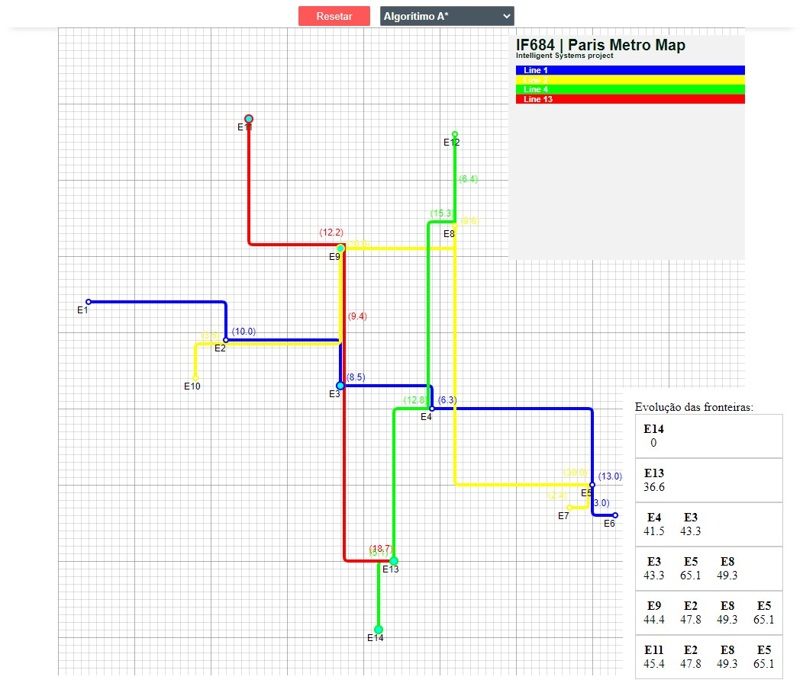

# IF684 A* at Paris Station
Project with the goal to find the shortest path between two stations in the Paris Metro, using the A* algorithm, generating a map of the stations and their routes, and seeing the cost of the travel.



## Features

- Many graph search algorithms
    - A* algorithm
    - Dijkstra's algorithm
    - Breadth-first search
    - Depth-first search
    - Best-first search
    - Greedy search
- Can generate a map of the stations and their routes
    - Change the stations and their routes and positions
    - Change the costs of the routes
- Can see the cost of the travel

## Made with

- Flask/Python and Jinja
- HTML/CSS/JS
- Pytest and Github Actions
- Husky to Git Hooks

## How to install

Run the following command in your terminal, to install the husky (a tool to apply a shared git's hook)::

```bash
npm install
npm run prepare
```

Or, if you're using yarn:

```bash
yarn
yarn prepare
```

And run the following command to install the python dependencies:

```bash
pip install -r requirements.txt
```

## How to run

Start the flask server by running the following command in your terminal:
```bash
python main.py
```
And enter in the browser at the address http://localhost:5000

## Generating a map from CSV files

The `real_cost.csv` file contains the information about the **real routes** between the stations, with the cost to go from one station to another. The `direct_cost.csv` file contains the information about the **euclidean distance** between all stations. Finally the `nodes.csv` file contains the information about the **lines, color of the line, stations and their respective positions**.

---

_Thank you for reading!_